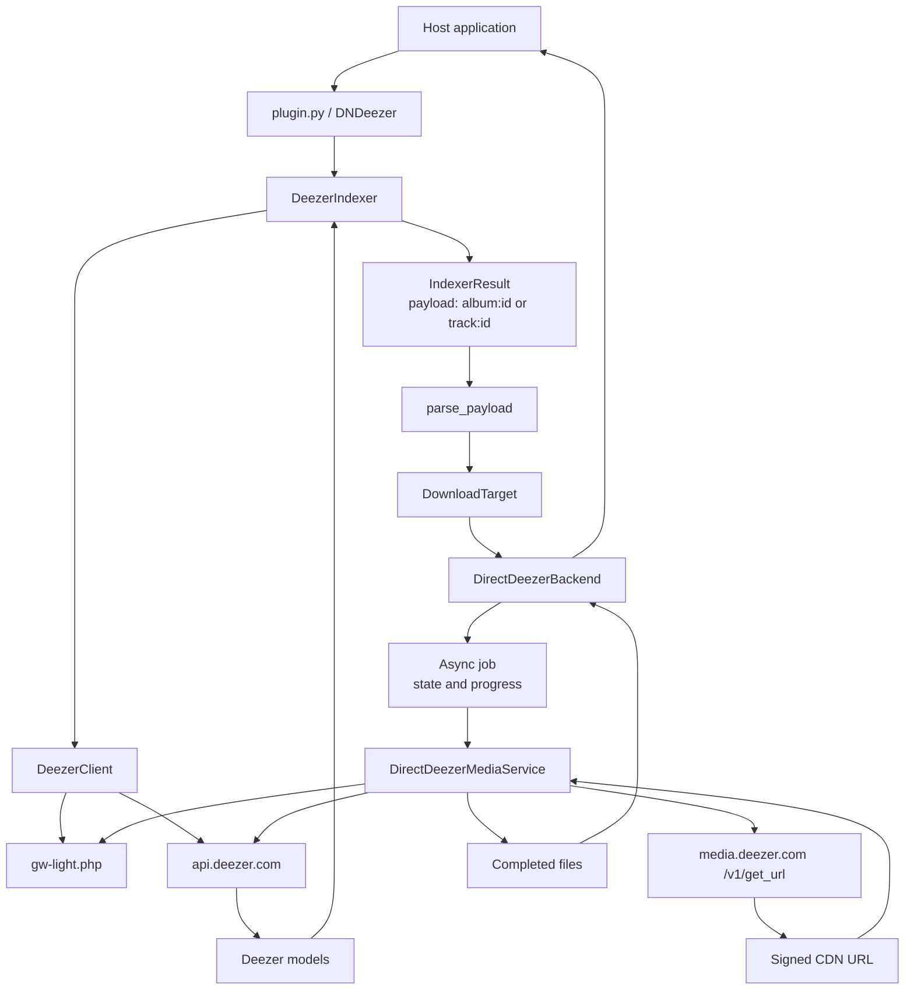
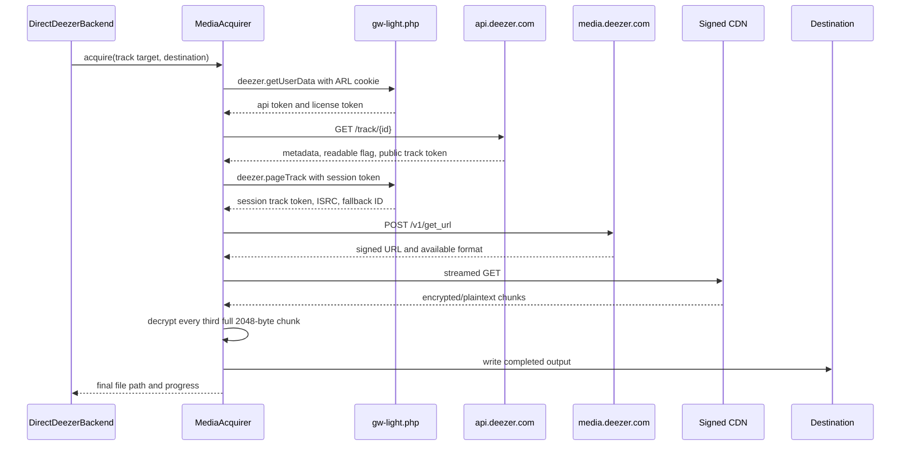

# Plugin
This plugin provides downloading support from Deezer, quality limited by account max.

## Installation

DNDeezer targets DroppedNeedle Plugin API v1. In DroppedNeedle v2.13.0,
open **Settings → Plugins**, install `https://github.com/Sarpar12/DNDeezer`,
configure the settings below, and enable the plugin.

After enabling, inspect `/api/v1/plugins/sources` using an authenticated admin
session. The Deezer source should report `has_client` and `has_indexer` as true,
`target_source` as `plugin:deezer-download`, `configured` as true, and healthy
status. An actual search and download is still needed to verify the full flow.

## Configuration

`plugin.toml` declares one complete source (`download_client` + `indexer`,
target `plugin:deezer-download`) with three admin settings:

| Setting | Required / default | Purpose |
| --- | --- | --- |
| `arl` | Required | Deezer ARL cookie, stored as a secret. Download quality is limited by the account. |
| `downloads_dir` | Required | Directory for staged downloads. Must be writable by DroppedNeedle and on the same filesystem as the library. |
| `state_dir` | Optional; `/app/config/dndeezer` | Persistent local directory containing `jobs.sqlite3`. Must be writable and outside the replaceable plugin installation directory. Restart the plugin after changing it. |

### Docker storage

Use **container paths** for these settings. Keep `/app/config` mounted to
persistent storage so the default job database survives container recreation.
For example, retain a Compose mount such as:

```yaml
volumes:
  - ./config:/app/config
```

The configured `downloads_dir` must also be backed by persistent storage.
Each download uses a workspace at `<downloads_dir>/<backend UUID>/`.

### Persistent job state

The database records job ownership and completed file paths before and during
downloads. Completed jobs remain available for inspection and cleanup after a
restart, using their original workspace even if `downloads_dir` changes. Keep
that original location accessible until cleanup finishes.

Previously running jobs are marked interrupted rather than resumed. Stop the
old plugin workers before starting a replacement instance; do not run multiple
instances against the same registry. When relocating `state_dir`, retain the
existing database so its job mappings remain available.

Cleanup retains a cleaned record for repeated host requests. Failed deletion
retains ownership for retry. See [`db/README.md`](db/README.md) for optional
database maintenance.

## Known limitations

- For requests with one expected track, the plugin expands album search results
  into individual track candidates, each with a filename and `track:<id>` payload.
  This lets the host match a missing song without downloading an entire album,
  and also supports genuine one-track releases. Tracklist lookups share the
  search timeout; unavailable albums are skipped rather than offered as whole
  album downloads. This requires the host's per-file plugin matching support.
- After updating plugin code, restart the DroppedNeedle container. Reloading
  only the plugin entrypoint can leave imported Python modules cached.

- **Automatic cleanup requires the host-side fix in
  [DroppedNeedle PR #478](https://github.com/DroppedNeedle/DroppedNeedle/pull/478)
  or an equivalent fix.** Hosts with the old cleanup routing can reject plugin
  jobs with `materialization_fingerprint_missing` before calling plugin cleanup.
  SQLite persistence alone does not fix this. Existing fingerprint-related
  `needs_attention` attempts may still require reconciliation or manual cleanup.
- Old handles lost before persistence was introduced cannot be reconstructed
  automatically.
- FLAC files receive embedded Deezer text metadata; cover-art embedding and
  MP3 tagging are not implemented.
- The plugin requires host modules that are not part of this repository; the
  test suite stubs them via `tests/conftest.py`. Search and download boundary
  types use the public `infrastructure.plugins.protocols` surface.
  `ServiceStatus` still comes from `models.common` because DroppedNeedle
  v2.13.0 does not re-export it through the public plugin API.

## Architecture

The project has two connected paths: the indexer discovers Deezer content, while
the download backend turns a selected result into media files.



`build_direct_backend()` in `backends/direct.py` is the single wiring point:
it assembles the `DeezerClient`, the `DirectDeezerMediaService`, and the
`DirectDeezerBackend` from the host's HTTP client, ARL, and downloads
directory.

### Client behaviour

At most two download jobs run concurrently per plugin instance; additional jobs
remain queued. Live status includes a matched transfer, active state, and actual
materialized byte progress so the host can distinguish queued work from a
missing transfer. The byte count is a monotonic high-water mark of workspace
file sizes, not a network traffic counter.

Track acquisition retries transport failures and HTTP 408/429/500/502/503/504
up to three total attempts with exponential backoff and jitter. Each retry
resolves media again and starts a fresh partial file and decryptor; cancellation
and non-transient failures are not retried. Exhausted album tracks are logged
and skipped.

All Deezer API and gateway calls go through one `DeezerClient` per job, which:

- authenticates via `deezer.getUserData` and caches the session
  (`checkForm`/license tokens) for the client's lifetime;
- throttles outgoing requests to one per `min_interval` (default 200 ms);
- retries `429`/`503` responses with exponential backoff (3 attempts).

### Search path

1. `plugin.py` exposes `DNDeezer` to the host application.
2. `DeezerIndexer` reads the ARL from host settings and creates a
	`DeezerClient` using the host's async HTTP client.
3. The client authenticates through `gw-light.php` and searches the public
	Deezer API for albums or tracks.
4. JSON responses become immutable `DeezerAlbum` and `DeezerTrack` models.
5. The indexer scores candidates and returns host `IndexerResult` objects with
	payloads such as `album:302127` or `track:3135555`.

The indexer discovers and identifies content; it does not retrieve media.

### Download path

The host parses the selected payload into a `DownloadTarget` and passes it to
the `DownloadBackend` abstraction. `DirectDeezerBackend` owns the asynchronous
job lifecycle: it validates the destination, creates jobs, tracks state and
progress, handles cancellation, and returns completed file paths.

`DirectDeezerMediaService` owns the media-specific work. A direct track
acquisition follows this pipeline:



The media layer prefers the session-bound track token returned by
`deezer.pageTrack`. If a track is not readable, it can resolve an alternative
using Deezer's fallback ID, ISRC search, or artist/title search. The ID actually
used for media is retained because it is also used to derive the decryption key.

The URL response is checked in quality order: FLAC, MP3 320, then MP3 128.
Only the `BF_CBC_STRIPE` cipher is accepted. The CDN response is streamed, and
the output is only reported as complete after all transformed bytes have been
written. Decryption and disk writes run in sequential worker-thread batches,
keeping blocking work off the host event loop. Cancellation waits for the
current batch before closing the file and removing the temporary output.

### Album downloads

An `album:<id>` payload reuses the same track pipeline:

1. One authentication is shared by the whole album.
2. Album metadata and the full tracklist come from a single
	`GET /album/{id}` call, with the tracklist fetched through its `tracklist`
	URL using `?limit=1000` plus `next` pagination.
3. Tracks download sequentially into a sanitized
	`Artist - Album/` directory below the job destination, named
	`NN - Title.ext` with zero-padded track positions.
4. Per-track progress is rescaled to the whole album.
5. A failed track is skipped; the job only fails if the album produces no
	files at all, in which case the first failure reason is reported.

### Ownership boundaries

| Component | Responsibility |
| --- | --- |
| `plugin.py` | Host plugin entry point |
| `indexer.py` | Search, scoring, and host result conversion |
| `deezer/client.py` | Deezer HTTP calls, authentication, throttling, retries, and JSON parsing |
| `deezer/models.py` | Typed Deezer domain objects |
| `backend.py` | Download contracts, job values, and payload parsing |
| `backends/direct.py` | Async job lifecycle, filesystem readiness, and `build_direct_backend()` wiring |
| `download_client.py` | Host `download_client` capability adapter (handles, status mapping) |
| `deezer/media.py` | Media acquisition (tracks and albums) and progress reporting |

## Development

The project is managed with [uv](https://docs.astral.sh/uv/) (Python 3.13):

```sh
uv sync --frozen        # install locked dependencies, including dev group
uv run ruff check .     # lint
uv run pytest tests/ -q # test suite
```

The pipeline tests fake only the HTTP transport, so the client, media service,
and backend run for real — including two end-to-end tests that drive
`parse_payload("track:…")` and `parse_payload("album:…")` through the whole
stack (`tests/test_integration.py`). `scripts/live.py` is a manual smoke script that
hits the live Deezer API with `DEEZER_ARL` set.

CI (`.forgejo/workflows/ci.yml`) runs the lint and test commands above on
every push and pull request.

## Acknowledgements

[Octo-Fiesta](https://github.com/V1ck3s/octo-fiesta) - Deezer Download
Implementation reference

[Dropped-Needle](https://github.com/DroppedNeedle/DroppedNeedle) - Basic download client base
