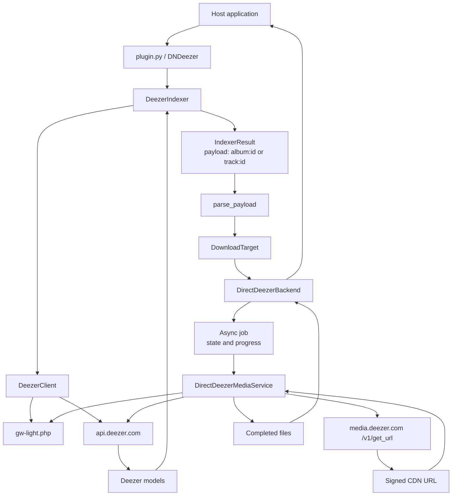
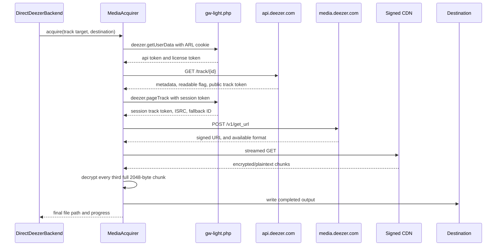

# Plugin
This plugin provides downloading support from Deezer, quality limited by account max. 

## Architecture

The project has two connected paths: the indexer discovers Deezer content, while
the download backend turns a selected result into media files.

### Search path

1. `plugin.py` exposes `DNDeezer` to the host application.
2. `DeezerIndexer` reads the ARL from host settings and creates a
	`DeezerClient` using the host's async HTTP client.
3. The client authenticates through `gw-light.php` and searches the public
	Deezer API for albums or tracks.
4. JSON responses become immutable `DeezerAlbum` and `DeezerTrack` models.
5. The indexer scores candidates and returns host `IndexerResult` objects with
	payloads such as `album:302127` or `track:3135555`.

The indexer discovers and identifies content; it does not retrieve media.

### Download path

The host parses the selected payload into a `DownloadTarget` and passes it to
the `DownloadBackend` abstraction. `DirectDeezerBackend` owns the asynchronous
job lifecycle: it validates the destination, creates jobs, tracks state and
progress, handles cancellation, and returns completed file paths.

`DirectDeezerMediaService` owns the media-specific work. A direct track
acquisition follows this pipeline:

The media layer prefers the session-bound track token returned by
`deezer.pageTrack`. If a track is not readable, it can resolve an alternative
using Deezer's fallback ID, ISRC search, or artist/title search. The ID actually
used for media is retained because it is also used to derive the decryption key.

The URL response is checked in quality order: FLAC, MP3 320, then MP3 128.
The CDN response is streamed, and the output is only reported as complete after
all transformed bytes have been written.

### Ownership boundaries

| Component | Responsibility |
| --- | --- |
| `plugin.py` | Host plugin entry point |
| `indexer.py` | Search, scoring, and host result conversion |
| `deezer/client.py` | Deezer HTTP calls, authentication, and JSON parsing |
| `deezer/models.py` | Typed Deezer domain objects |
| `backend.py` | Download contracts, job values, and payload parsing |
| `backends/direct.py` | Async job lifecycle and filesystem readiness |
| `deezer/media.py` | Media acquisition and progress reporting |

## Acknowledgements

[Octo-Fiesta](https://github.com/V1ck3s/octo-fiesta) - Deezer Download
Implementation reference