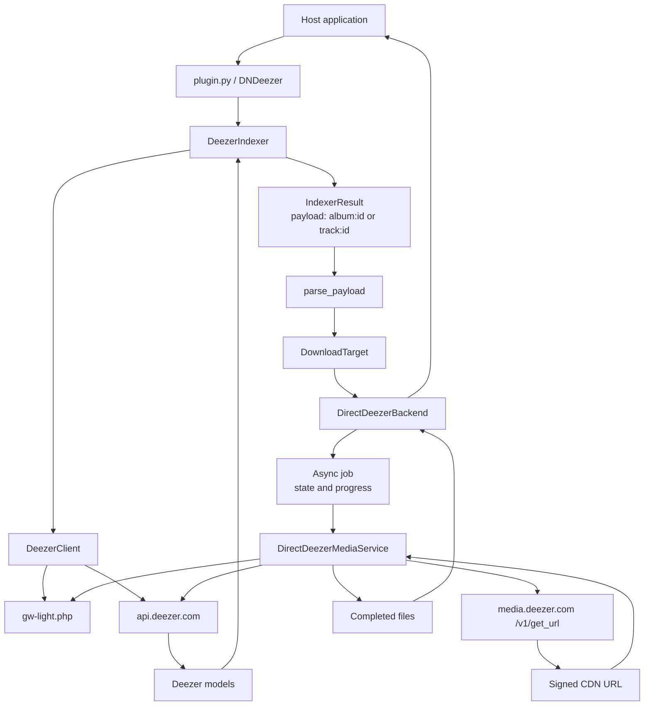
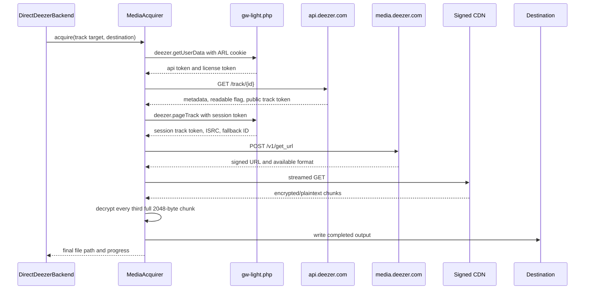

# Plugin
This plugin provides downloading support from Deezer, quality limited by account max.

## Architecture

The project has two connected paths: the indexer discovers Deezer content, while
the download backend turns a selected result into media files.



`build_direct_backend()` in `backends/direct.py` is the single wiring point:
it assembles the `DeezerClient`, the `DirectDeezerMediaService`, and the
`DirectDeezerBackend` from the host's HTTP client, ARL, and downloads
directory.

### Client behaviour

All Deezer API and gateway calls go through one `DeezerClient` per job, which:

- authenticates via `deezer.getUserData` and caches the session
  (`checkForm`/license tokens) for the client's lifetime;
- throttles outgoing requests to one per `min_interval` (default 200 ms);
- retries `429`/`503` responses with exponential backoff (3 attempts).

### Search path

1. `plugin.py` exposes `DNDeezer` to the host application.
2. `DeezerIndexer` reads the ARL from host settings and creates a
	`DeezerClient` using the host's async HTTP client.
3. The client authenticates through `gw-light.php` and searches the public
	Deezer API for albums or tracks.
4. JSON responses become immutable `DeezerAlbum` and `DeezerTrack` models.
5. The indexer scores candidates and returns host `IndexerResult` objects with
	payloads such as `album:302127` or `track:3135555`.

The indexer discovers and identifies content; it does not retrieve media.

### Download path

The host parses the selected payload into a `DownloadTarget` and passes it to
the `DownloadBackend` abstraction. `DirectDeezerBackend` owns the asynchronous
job lifecycle: it validates the destination, creates jobs, tracks state and
progress, handles cancellation, and returns completed file paths.

`DirectDeezerMediaService` owns the media-specific work. A direct track
acquisition follows this pipeline:



The media layer prefers the session-bound track token returned by
`deezer.pageTrack`. If a track is not readable, it can resolve an alternative
using Deezer's fallback ID, ISRC search, or artist/title search. The ID actually
used for media is retained because it is also used to derive the decryption key.

The URL response is checked in quality order: FLAC, MP3 320, then MP3 128.
Only the `BF_CBC_STRIPE` cipher is accepted. The CDN response is streamed, and
the output is only reported as complete after all transformed bytes have been
written. Decryption and disk writes run in sequential worker-thread batches,
keeping blocking work off the host event loop. Cancellation waits for the
current batch before closing the file and removing the temporary output.

### Album downloads

An `album:<id>` payload reuses the same track pipeline:

1. One authentication is shared by the whole album.
2. Album metadata and the full tracklist come from a single
	`GET /album/{id}` call, with the tracklist fetched through its `tracklist`
	URL using `?limit=1000` plus `next` pagination.
3. Tracks download sequentially into a sanitized
	`Artist - Album/` directory below the job destination, named
	`NN - Title.ext` with zero-padded track positions.
4. Per-track progress is rescaled to the whole album.
5. A failed track is skipped; the job only fails if the album produces no
	files at all, in which case the first failure reason is reported.

### Ownership boundaries

| Component | Responsibility |
| --- | --- |
| `plugin.py` | Host plugin entry point |
| `indexer.py` | Search, scoring, and host result conversion |
| `deezer/client.py` | Deezer HTTP calls, authentication, throttling, retries, and JSON parsing |
| `deezer/models.py` | Typed Deezer domain objects |
| `backend.py` | Download contracts, job values, and payload parsing |
| `backends/direct.py` | Async job lifecycle, filesystem readiness, and `build_direct_backend()` wiring |
| `download_client.py` | Host `download_client` capability adapter (handles, status mapping) |
| `deezer/media.py` | Media acquisition (tracks and albums) and progress reporting |

## Configuration

`plugin.toml` declares the plugin as one complete source
(`download_client` + `indexer`, target `plugin:deezer-download`) with two
admin settings: `arl` (the Deezer ARL cookie, stored as a secret) and
`downloads_dir` (where completed files are staged).

### Installation and runtime dependencies

DNDeezer targets DroppedNeedle Plugin API v1. In DroppedNeedle v2.13.0,
open **Settings → Plugins**, install `https://github.com/Sarpar12/DNDeezer`,
configure `arl` and `downloads_dir`, and enable the plugin. The staging directory
must be writable by DroppedNeedle and on the same filesystem as the library.

The plugin requires `cryptography>=46.0.0` and `httpx>=0.28.1` in the host's
Python environment. Plugin installation is not documented to install
`pyproject.toml` dependencies or create a separate virtual environment. Verify
the dependencies using the Python interpreter that runs DroppedNeedle, inside
its container if applicable:

```sh
python -c 'from importlib.metadata import version; from cryptography.hazmat.decrepit.ciphers.algorithms import Blowfish; import httpx; print("cryptography", version("cryptography")); print("httpx", version("httpx"))'
```

If missing or below the required versions, provision them in the host environment
or container image before enabling the plugin. DNDeezer uses the host-provided
`context.http` client.

After enabling, inspect `/api/v1/plugins/sources` using an authenticated admin
session. The Deezer source should report `has_client` and `has_indexer` as true,
`target_source` as `plugin:deezer-download`, `configured` as true, and healthy
status. An actual search and download is still needed to verify the full flow.

## Development

The project is managed with [uv](https://docs.astral.sh/uv/) (Python 3.13):

```sh
uv sync --frozen        # install locked dependencies, including dev group
uv run ruff check .     # lint
uv run pytest tests/ -q # test suite
```

The pipeline tests fake only the HTTP transport, so the client, media service,
and backend run for real — including two end-to-end tests that drive
`parse_payload("track:…")` and `parse_payload("album:…")` through the whole
stack (`tests/test_integration.py`). `scripts/live.py` is a manual smoke script that
hits the live Deezer API with `DEEZER_ARL` set.

CI (`.forgejo/workflows/ci.yml`) runs the lint and test commands above on
every push and pull request.

## Known limitations

- No metadata or cover-art embedding; files are written as raw decrypted audio.
- The plugin requires host modules that are not part of this repository; the
	test suite stubs them via `tests/conftest.py`. Search and download boundary
	types use the public `infrastructure.plugins.protocols` surface.
	`ServiceStatus` still comes from `models.common` because DroppedNeedle
	v2.13.0 does not re-export it through the public plugin API.

## Acknowledgements

[Octo-Fiesta](https://github.com/V1ck3s/octo-fiesta) - Deezer Download
Implementation reference

[Dropped-Needle](https://github.com/DroppedNeedle/DroppedNeedle) - Basic download client base
